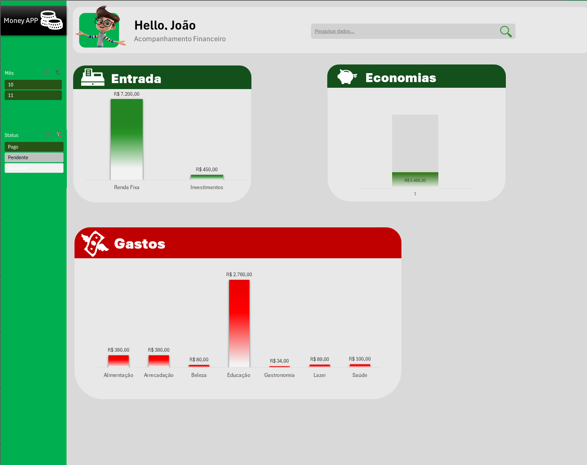

Este projeto demonstra como o Excel pode ser uma ferramenta poderosa para visualização de dados financeiros e organização pessoal.
# Dashboard de Controle Financeiro 💼

Este repositório contém um **dashboard simples para controle financeiro** desenvolvido em Excel como parte de um curso. Com este projeto, é possível visualizar e organizar receitas, despesas e saldo de forma prática, auxiliando na gestão financeira pessoal.

### Funcionalidades Principais:
- Análise das receitas e despesas por categoria
- Gráficos dinâmicos para acompanhamento de saldo e tendências financeiras
- Layout intuitivo para fácil navegação e uso

### Visualização do Dashboard

### Download do Arquivo Excel

[Clique aqui para baixar o arquivo Excel](/Dashboard_Controle_Financeiro.xlsx)

Este projeto demonstra como o Excel pode ser uma ferramenta poderosa para visualização de dados financeiros e organização pessoal.### Como Utilizar o Dashboard

Para utilizar o dashboard de controle financeiro, siga os passos abaixo:

1. **Download do Arquivo**: Clique no link acima para baixar o arquivo Excel. Após o download, abra o arquivo em sua aplicação Excel.

2. **Inserção de Dados**: Navegue até a aba de “Entradas” onde você poderá inserir suas receitas e despesas. Certifique-se de preencher as categorias corretamente para facilitar a análise.

3. **Visualização**: Após a inserção dos dados, acesse a aba do “Dashboard” para visualizar os gráficos e informações de resumo. Os gráficos dinâmicos se atualizarão automaticamente conforme você adicionar ou alterar os dados.

4. **Análise**: Utilize as informações visuais para identificar padrões nas suas finanças. Avalie quais categorias estão consumindo mais recursos e quais são as fontes de receita mais eficazes.

5. **Ajustes e Planejamento**: Com as análises em mãos, você pode ajustar seus hábitos de consumo e criar um planejamento financeiro mais eficaz. Faça uso das informações para definir metas financeiras e acompanhar seu progresso.

### Contribuindo com o Projeto

Este projeto é de código aberto e qualquer contribuição é bem-vinda! Se você possui melhorias, sugestões de novas funcionalidades ou correções, sinta-se à vontade para abrir um **pull request** ou discutir suas ideias na seção de **Issues**.

### Agradecimentos

Agradeço a todos que participaram do desenvolvimento deste projeto  as instrutores do curso, que contribuíram com valiosas orientações. Espero que este dashboard seja útil para sua jornada financeira e que você consiga alcançar suas metas com mais facilidade!
